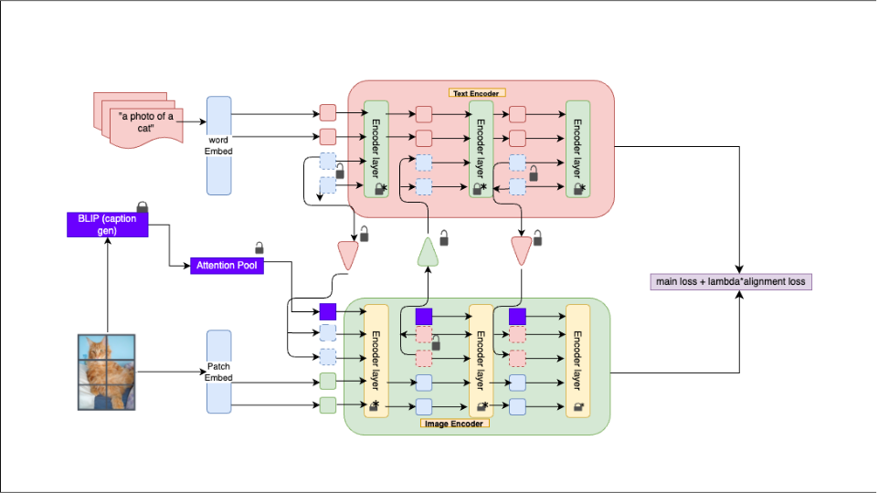
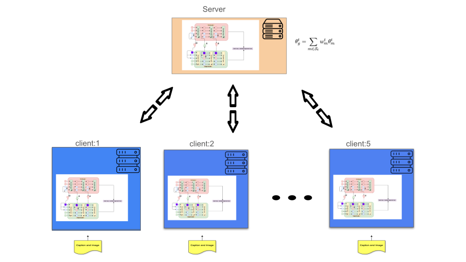

# DualPrompt: Leveraging Vision-Language Models and Federated Learning for Satellite Image Classification

This repository contains the official implementation for **DualPrompt**, a novel approach for adapting large-scale Vision-Language (V-L) models for satellite image classification. The project features implementations for both standard centralized and privacy-preserving federated learning setups.


*Overview of the DualPrompt architecture with inter-branch communication.*

---

## Table of Contents
- [Introduction](#introduction)
- [Our Contribution](#our-contribution)
- [Methodology](#methodology)
  - [Dual-Prompting Mechanism](#dual-prompting-mechanism)
  - [Federated Learning Setup](#federated-learning-setup)
- [Key Results](#key-results)
  - [Centralized (Non-Federated) Performance](#centralized-non-federated-performance)
  - [Federated Learning Performance](#federated-learning-performance)
- [Installation](#installation)
- [Usage](#usage)
  - [Datasets](#datasets)
  - [Running the Code](#running-the-code)
- [License](#license)
- [Citation](#citation)
- [Acknowledgements](#acknowledgements)

---

## Introduction

Large-scale Vision-Language (V-L) models like CLIP have demonstrated remarkable generalization capabilities. However, their performance is highly sensitive to the input text prompts, and full fine-tuning is often impractical due to massive model sizes and the risk of catastrophic forgetting. While prompt learning has emerged as a parameter-efficient alternative, existing methods primarily focus on the language branch, which is a suboptimal approach.

This project addresses these challenges, particularly in the context of satellite imagery where data is often sensitive and distributed. Centralized training in such scenarios is frequently not feasible, making a strong case for privacy-preserving techniques like Federated Learning (FL).

## Our Contribution

To tackle the limitations of unimodal prompting, we introduce **DualPrompt**, a novel method with the following key contributions:

1.  **Dual-Prompting**: We introduce learnable prompts in **both** the vision and language branches of the V-L model, allowing for dynamic, multi-modal adaptation.
2.  **Strong Coupling Mechanism**: Our design promotes synergy between the vision and language prompts through a bidirectional information sharing mechanism and coupled context optimization.
3.  **Federated Learning Integration**: We successfully adapt and evaluate DualPrompt in a federated learning setting, demonstrating its viability for decentralized and privacy-preserving training on sensitive satellite imagery.

## Methodology

### Dual-Prompting Mechanism

The core of DualPrompt is the introduction of learnable prompts, $\mathbf{P}_i$ (language) and $\mathbf{Q}_i$ (vision), at alternating layers of the V-L model's encoders.

-   **Bidirectional Prompt Sharing**: Information from the language prompts is projected and injected into the vision branch, and vice-versa, creating a tight coupling.
-   **Coupled Context Optimization**: Learnable context prompts in each branch are conditioned on each other via dedicated coupling functions (linear layers).
-   **Parameter-Efficiency**: We keep the pretrained model backbone frozen and only update the prompts, normalization layers, and a few lightweight coupling and attention layers.
-   **Compound Loss**: Our training objective is a combination of a standard cross-entropy classification loss and a cosine similarity-based alignment loss to ensure the vision and language representations remain aligned.

$$L_{\text{total}} = L_{\text{cls}} + \lambda_{\text{align}} L_{\text{align}}$$


*Our model in a federated learning setting.*

### Federated Learning Setup

We implement DualPrompt in a federated environment using a variant of the FedAvg algorithm.

1.  **Initialization**: A central server initializes the global learnable parameters ($\theta_g^0$).
2.  **Distribution**: The server sends the current global model to a set of clients.
3.  **Local Training**: Each client trains the model on its local, private data for a few epochs.
4.  **Aggregation**: The server aggregates the updated parameters from the clients to create a new global model. This process is repeated for a set of communication rounds.

This setup ensures that the raw data never leaves the client's device, thus preserving privacy.

---

## Key Results

We evaluated DualPrompt in both centralized and federated settings, primarily in a challenging 16-shot learning scenario.

### Centralized (Non-Federated) Performance

DualPrompt shows robust generalization capabilities, outperforming several state-of-the-art baselines.

**Base to New Class Generalization:**

| Dataset | Model | Base Accuracy | New Accuracy |
| :--- | :--- | :---: | :---: |
| **PatternNet** | CoOp | 94.20% | 45.40% |
| | CoCoOp | 92.50% | 60.30% |
| | MaPLE | 96.00% | 85.00% |
| | **DualPrompt (Ours)** | **96.90%** | **84.50%** |
| **UC Merced** | CoOp | 96.00% | 57.50% |
| | CoCoOp | 97.30% | 68.00% |
| | MaPLE | 98.20% | 69.00% |
| | **DualPrompt (Ours)** | **98.60%** | **71.00%** |

**Cross-Dataset Generalization (Train on Ucmerced $\rightarrow$ Test on PatternNet):**

| Model | Ucmerced (Source) | PatternNet (Target) |
| :--- | :---: | :---: |
| CoOp | 91.90% | 57.30% |
| CoCoOp | 89.00% | 56.70% |
| MaPLE | 87.60% | 70.40% |
| **DualPrompt (Ours)** | **91.00%** | **75.00%** |

### Federated Learning Performance

In a federated setup with 5 clients over a unified dataset of 80 satellite image classes, DualPrompt significantly outperforms other federated methods.

**Overall Accuracy on Unified Test Set:**

| Model | Test Accuracy |
| :--- | :---: |
| FedCoop | 36.65% |
| FedTPG | 52.97% |
| FedMaPLe | 60.20% |
| **Fed-DualPrompt (Ours)** | **76.91%** |

**Cross-Dataset Generalization (Trained on 5 datasets, Tested on unseen RESISC45):**

| Model | Test Accuracy on RESISC45 |
| :--- | :---: |
| FedCoop | 45.42% |
| FedTPG | 49.16% |
| FedMaPLe | 59.70% |
| **Fed-DualPrompt (Ours)** | **63.32%** |

**t-SNE Visualization of Feature Embeddings on RESISC45:**

Our model learns more discriminative and well-separated features compared to strong baselines like FedMaPLe, as shown by the t-SNE plots and clustering metrics (higher Silhouette score and lower Davies-Bouldin Index).

| | FedMaPLe | Our Model (Fed-DualPrompt) |
| :--- | :---: | :---: |
| **Silhouette Score** | 0.1926 | **0.3679** |
| **Davies-Bouldin Index** | 1.9008 | **1.2965** |


---

## Installation

1.  **Clone the repository:**
    ```bash
    git clone [https://github.com/your-username/DualPrompt.git](https://github.com/your-username/DualPrompt.git)
    cd DualPrompt
    ```

2.  **Create and activate a conda environment:**
    ```bash
    conda create -n dualprompt python=3.8
    conda activate dualprompt
    ```

3.  **Install dependencies:**
    ```bash
    same dependencies as dassl
    ```

## Usage

### Datasets

The following datasets were used in our experiments:
-   [PatternNet](http://www.grss-ieee.org/community/technical-committees/image-analysis-and-data-fusion/patternnet/)
-   [UC Merced Land Use](http://weegee.vision.ucmerced.edu/datasets/landuse.html)
-   [EuroSAT](https://github.com/phelber/EuroSAT)
-   MLRSNet
-   Million-AID
-   [RESISC45](http://www.escience.cn/people/JunweiHan/NWPU-RESISC45.html) (for cross-dataset evaluation)

Please download the datasets and structure them as expected by the data loaders. You will need to unify the classes for the federated learning setup as described in the paper.

Here is the requested "Running the Experiments" section in Markdown format.

---

## **Running the Experiments**

This section outlines the commands to train and evaluate the **DualPrompt** model in both centralized and federated learning environments.

### **Prerequisites**

Before proceeding, please ensure that you have:
1.  **Installed all dependencies** refer to dassl repository.
2.  **Downloaded the required datasets** (e.g., PatternNet, UC Merced, EuroSAT) and configured the data paths correctly.

### **Script Arguments**

The execution scripts accept the following command-line arguments:
* `--dataset`: **(Required)** The name of the target dataset (e.g., `patternnet`, `ucmerced`).
* `--seed`: **(Required)** An integer for the random seed to ensure reproducible results (e.g., `1`, `42`).
* `-epoch`: **(Required for testing)** The epoch number of the saved model checkpoint to evaluate (e.g., `50`).

---

### **Centralized Training**

To train the model on a single, centralized dataset, use the following command structure.

#### **Syntax**
```bash
bash scripts/dualpromptcentralized/xd_train_dualprompt --dataset [DATASET_NAME] --seed [SEED_NUMBER]
```

#### **Example (Training on PatternNet with seed 1)**
```bash
bash scripts/dualpromptcentralized/xd_train_dualprompt --dataset patternNet --seed 1
```

---

### **Federated Learning Simulation**

These scripts simulate the federated training and evaluation process across multiple clients.

#### **1. Federated Training**

This script initiates a complete federated training run, aggregating model updates over a series of communication rounds.

##### **Syntax**
```bash
bash scripts/dualpromptfl/xd_train_dualprompt.sh --dataset [UNIFIED_DATASET] --seed [SEED_NUMBER]
```

##### **Example (Starting a federated run with seed 42)**
```bash
bash scripts/dualpromptfl/xd_train_dualprompt.sh --dataset PatternNet --seed 42
```
*(Note: Replace `--dataset` with the name of the dataset used in your federated setup.)*

#### **2. Federated Testing**

After federated training is complete, this script evaluates the performance of a specific global model checkpoint.

##### **Syntax**
```bash
bash scripts/dualpromptfl/xd_test_dualprompt.sh --dataset [UNIFIED_DATASET] --seed [SEED_NUMBER] -epoch [EPOCH_TO_TEST]
```

##### **Example (Evaluating the model from round 50)**
```bash
bash scripts/dualpromptfl/xd_test_dualprompt.sh --dataset PatternNet --seed 42 -epoch 50
```
